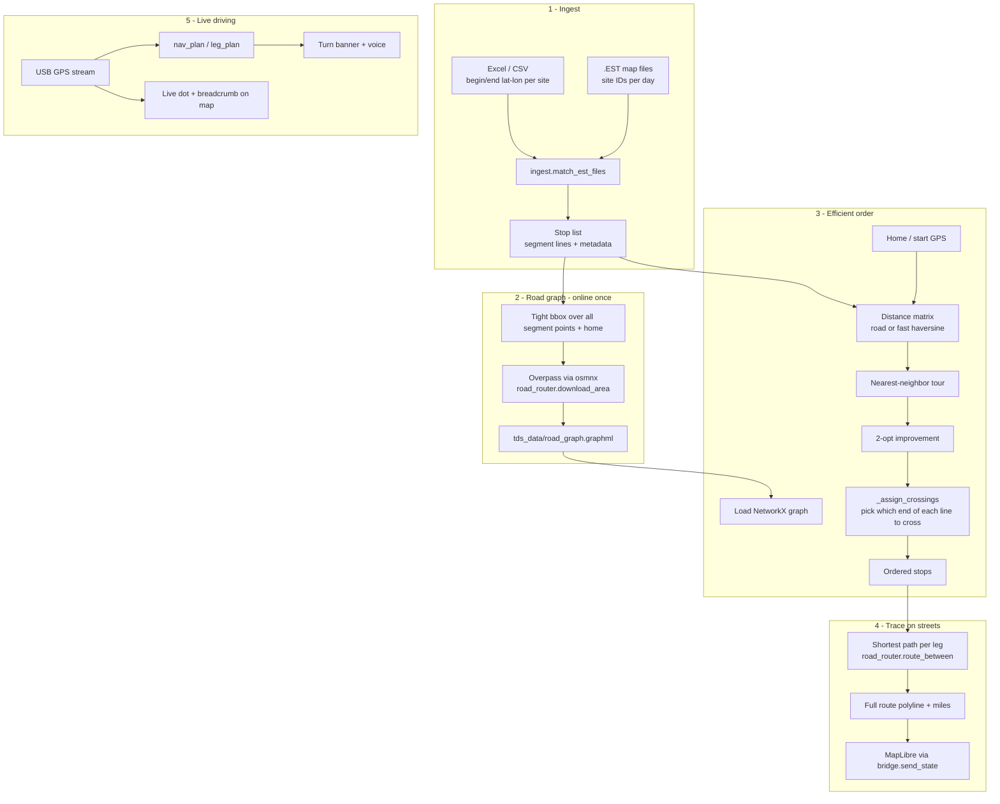

# Routing & map tracing — how efficient routes are built

Traffic Deployer matches the field workflow from **Excel + `.EST`**: each site is a **street segment** (begin → end), not a single pin. The app orders those segments to **minimize drive miles**, then **traces the path on real roads** using a downloaded OpenStreetMap graph. Everything after setup runs **offline** on the laptop.

---

## Two map layers (do not confuse them)

| Layer | File | Purpose | When it is created |
|--------|------|---------|-------------------|
| **California basemap** | `tds_data/california.pmtiles` | Offline street map tiles + labels in the UI | Once via `START.bat` → `setup_maps.py` |
| **Road routing graph** | `tds_data/road_graph.graphml` | Drive network for miles, order, and polylines | Per work area via **Download road map** or `scripts/download_road_map.py` |

The basemap is what you **see**. The road graph is what you **route on**.

---

## End-to-end pipeline

---

## 1. Ingest: from files to segment lines

**Modules:** `core/ingest.py`, `core/validate.py`

1. **`parse_excel_sites`** reads each row’s **begin** and **end** coordinates (and street name). The midpoint is stored but routing treats the site as a **line to cross**, not only a dot.
2. **`match_est_files`** joins Excel sites to symbols in each uploaded `.EST` (map day from filename, e.g. `Day5.EST` → `Day5`).
3. Each stop dict carries `begin_lat/lon`, `end_lat/lon`, `lat/lon` (midpoint), `street`, `map_day`, etc.

Validation (`validate.validate_build`) blocks builds with missing coords or empty matches before any routing runs.

---

## 2. Road graph download (coverage for the job area)

**Modules:** `road_router.py`, `worker_tasks.py` (CLI/worker), `scripts/download_road_map.py`

1. **`_gather_area_points`** (in `main.py`) collects **home** plus every segment **begin** and **end** for loaded files (or current shift).
2. **`road_router.bbox_for_points`** builds a **small bounding box** (+ ~1.5 km buffer), not a huge circle — less data, faster on Wi‑Fi.
3. **`road_router.download_area`** pulls the **drive** network from OpenStreetMap (Overpass) via **osmnx**, tries mirror servers, and **tiles** very large areas so work-site spans do not time out.
4. Graph saved to **`tds_data/road_graph.graphml`** — all later steps are offline.

---

## 3. Efficient stop order (cross each street line cheaply)

**Module:** `core/routing.py` — `optimize()`

Goal: order sites so total **road** travel between segment crossings is low, and each leg approaches the **best end** of the street line.

### Distance matrix

- Index `0` = **home**; `1..n` = each stop’s segment.
- For each segment, the graph exposes two **attachment points** (nearest road nodes to begin/end) via `road_router.segment_access`.
- Matrix entries use **shortest drive distance** between attachment points (or **haversine** for a fast matrix when the graph is large or there are many stops — order is approximate; **trace** still uses real roads).

### Tour improvement

1. **Nearest-neighbor** tour from home.
2. **2-opt** swaps to shorten the tour (pass count scales with stop count).

### Crossing side

**`_assign_crossings`** walks the ordered list:

- From current road position, compare drive distance to **begin** vs **end** attachment.
- Set `cross_side`, `cross_lat`, `cross_lon` (point on the segment line where the route should touch).
- Navigation targets use **field GPS** if stamped, else **crossing**, else midpoint (`_stop_pt`).

This is why the route is “efficient” for **traffic deployer** work: it optimizes **which way you cross each street line**, not just visiting map pins in Excel order.

---

## 4. Trace the route on real streets

**Module:** `core/routing.py` — `build_route()`

1. Re-run **`_assign_crossings`** on the final order.
2. For each leg **home → stop₁ → … → stopₙ → home**:
   - **`road_router.route_between`** — Dijkstra on the saved graph → polyline + miles + turn list.
   - **`_snap_leg_end`** — last point of the leg snaps to the **crossing** on the site line (road meets the segment, does not overshoot to midpoint).
3. Leg polylines are concatenated into one **`route.polyline`** for the map and total **`route.miles`**.

If no road graph exists, the app falls back to **straight chords** (`graph: false`) and Field Readiness warns you.

**UI thread:** `_RouteOptimizeThread` runs `optimize` then `build_route` so the window stays responsive (`main.py`).

---

## 5. Display on the map

**Modules:** `bridge.py`, `web/app.js`, `web/style.js`, `local_server.py`

| Step | What happens |
|------|----------------|
| Basemap | `california.pmtiles` served locally; MapLibre draws streets/buildings |
| Route line | `bridge.send_state()` → `window.__tdPushState` with `route.polyline`, stops, segment lines |
| Site lines | Each stop draws **begin–end** segment; badge at crossing / field point |
| GPS | `bridge.send_gps()` updates live position and breadcrumb |

**Driving mode:** only the **active leg** polyline is emphasized; `road_router.nav_plan` / `leg_plan` supply turn-by-turn maneuvers and voice (`voice_nav.py`).

---

## 6. Typical operator sequence

1. `START.bat` — basemap + venv (once).
2. Load **Excel + `.EST`**, set **home**.
3. **Download road map for these sites** — creates `road_graph.graphml` for that bbox.
4. **BUILD OPTIMIZED ROUTE** — runs §3 + §4 in a background thread.
5. **READY FOR OFFLINE** — field use without internet.
6. **START DRIVING** — GPS tracing + next-leg geometry only.

---

## Key source files

| File | Role |
|------|------|
| `core/ingest.py` | Excel/EST → stop segments |
| `core/routing.py` | Order + cross + street trace |
| `core/validate.py` | Pre-build checks |
| `road_router.py` | OSM graph download, Dijkstra, turn-by-turn |
| `main.py` | UI, threads, map state push |
| `bridge.py` | Python → MapLibre JSON |
| `setup_maps.py` | California `pmtiles` + vendor JS/fonts |
| `scripts/download_road_map.py` | Headless road-graph download (work laptop) |
| `scripts/diagnose_network.py` | Overpass / basemap reachability |

---

## Design notes

- **Segment-first routing** matches how sites are defined in the field (line across street), not “drive to Excel midpoint only.”
- **Fast matrix + accurate trace** keeps ordering under a minute for large jobs while polylines stay on OSM drive edges.
- **Tight bbox download** keeps Overpass queries small for a single week’s geography.
- **Child process was replaced by QThreads** for download/route (`_DownloadRoadsThread`, `_RouteOptimizeThread`) to avoid flaky `QProcess` on Windows while still keeping the UI alive.

For install, GPS, and smoke tests see [HOW_TO_RUN.md](HOW_TO_RUN.md).
